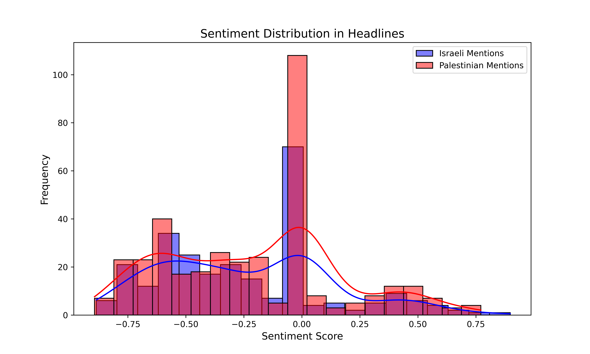
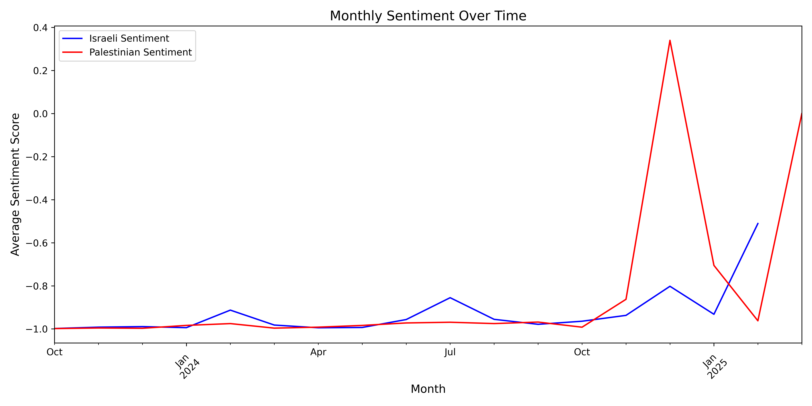
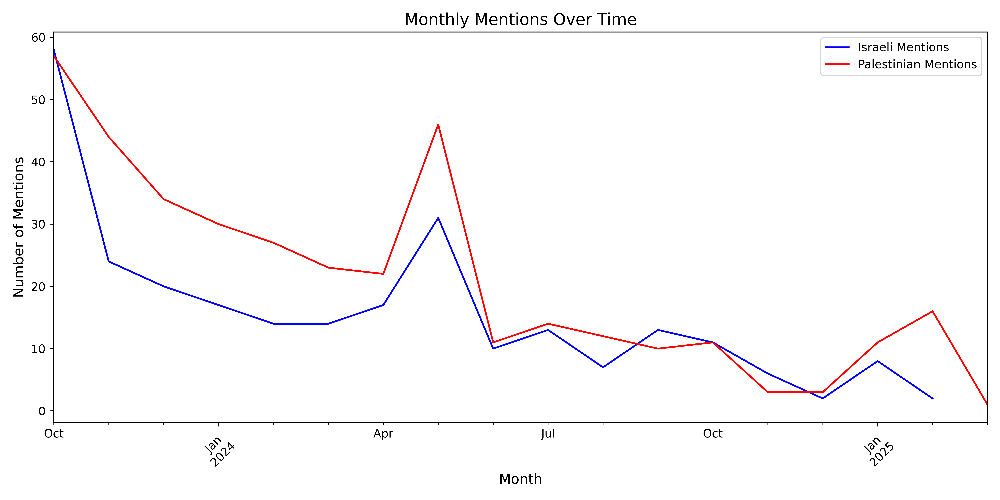

---

# Database of Israel-Palestine Headlines in the *New York Times*

---

## 📝 Abstract (Plain Language)

This project used the *NYT* Article Search API to scrape metadata from 915 articles containing mentions of Israeli and Palestinian topics published between October 2023 and March 2025. We extracted headline-level data and stored it in a structured SQLite database (`nyt_articles_metadata.db`) to support large-scale sentiment analysis. Although we initially aimed to extract full-text content, access limitations restricted our analysis to headlines.

Using natural language processing tools, we found that Palestinian key words were mentioned more frequently (375 mentions; 40.98%) than Israeli terms (267 mentions; 29.18%), with a mention ratio of 0.71 — meaning that for every 1 Israeli mention, there were 1.40 Palestinian mentions. A two-tailed z-test for the difference in proportions yielded a **z-statistic of 5.29** and a **p-value < 0.000001**, indicating the difference is statistically significant. 

The average sentiment score for headlines mentioning Palestinian topics was slightly less negative at **-0.208**, compared to **-0.239** for Israeli-related headlines. Both groups were most commonly framed in neutral terms, but sharp sentiment shifts aligned with major events — including a notable divergence in June 2024, when Palestinian sentiment turned positive and Israeli sentiment sharply declined.

---

## 🚀 Impact Statement

This project offers a reproducible pipeline and database for examining media bias in conflict reporting. By quantifying headline sentiment and frequency over time, it provides tools for journalists, scholars, and the public to critically assess framing and narrative tone in a high-impact news domain. The results are transparent, data-driven look at how one major media outlet frames issues related to Israel and Palestine.

---

## 🧪 Methods: How the Database Was Created

This section describes how we built the `nyt_articles_metadata.db` database of *NYT* articles for sentiment analysis.

---

### 1. 🔍 Article Collection via NYT API

We began by using the **NYT Article Search API** to collect metadata for articles related to Israeli and Palestinian topics.

- **Search Query:** `Israel OR Israeli OR Palestine OR Palestinian`
- **Date Range:** October 1, 2023 – March 7, 2025
- **API Key:** Accessed using a registered NYT developer key
- **Pagination:** The API was queried page-by-page with a randomized delay to avoid rate limits and bot detection
- **Retry Logic:** Each API call included exponential backoff for HTTP 429 errors (Too Many Requests)

The metadata collected for each article included:

- `headline`
- `web_url`
- `pub_date`
- `byline`
- `section`
- `full_text` (left blank initially)

All records were stored in a temporary SQLite database:  
**`nyt_articles_metadata.db`**

---

### 2. 🕷️ Attempted Scraping of Full Text Articles

Our original goal was to extract **full article text** for a richer sentiment analysis. To do this, we used:

- **Selenium WebDriver** (automated browser)
- **User-Agent Rotation** (to reduce bot detection)
- **Manual Login Prompt:** Users were prompted to log in to the NYT manually during script execution
- **Scroll Simulation:** Mimicked user scrolling to load article content
- **CAPTCHA Handling:** Basic detection and prompt for manual CAPTCHA solving

Despite these efforts, **full text scraping proved unreliable**, primarily due to:

- Dynamic page loading
- Paywall restrictions
- CAPTCHA interruptions
- Inconsistent page structure

As a result, we were only able to extract **headlines**, which we used as the basis for the sentiment analysis.

---

### 3. 💾 Database Construction

The final SQLite database (**`nyt_articles_metadata.db`**) was constructed using the `pandas` and `sqlite3` libraries:

- All article metadata (with empty `full_text`) was saved to a table called `articles`
- This database served as the foundation for downstream sentiment analysis using headlines

---

### 🔍 Why This Matters

While headlines are shorter than full articles, they are powerful in framing public perception and journalistic tone. By analyzing the sentiment of *NYT* headlines related to Israeli and Palestinian issues, we can gain insight into potential media bias — even in the absence of full article content.

---

## 🧠 What is Sentiment Analysis?

Sentiment analysis is a natural language processing (NLP) technique used to determine the emotional tone or attitude expressed in a piece of text, such as a headline, review, or social media post. It typically categorizes text as **positive**, **negative**, or **neutral**, and can sometimes detect more specific emotions like happiness, anger, or sadness.

In this case, sentiment analysis is applied to headlines from *NYT* to assess how the newspaper portrays topics related to **Israeli** and **Palestinian** issues.

---

## ⚙️ How the Sentiment Analysis Works

This sentiment analysis focuses on NYT headlines that mention specific terms related to Israeli or Palestinian topics. The process uses a tool called **VADER** (Valence Aware Dictionary and sEntiment Reasoner), which is particularly effective for analyzing short texts like headlines.

### 1. 🛠 Tools and Setup

**VADER** is a lexicon and rule-based sentiment analysis tool designed for short texts. It assigns sentiment scores using:

- A dictionary of words and phrases
- Punctuation emphasis (e.g., `"Great!"` vs. `"Great"`)
- Degree modifiers (e.g., `"very good"` vs. `"good"`)

**Key Terms** used to identify headlines:
- **Israeli terms:** `"Israel"`, `"Israeli"`, `"IDF"`
- **Palestinian terms:** `"Palestinian"`, `"Palestine"`, `"Hamas"`, `"Gaza"`

---

### 2. 📏 Calculating Sentiment Scores

For each headline, VADER’s `polarity_scores` method computes a **compound sentiment score**, ranging from:

- `-1`: Most negative sentiment  
- `0`: Neutral sentiment  
- `+1`: Most positive sentiment

**Example:**  
- `"Israel achieves breakthrough"` → compound score ≈ `0.7`  
- `"Gaza faces crisis"` → compound score ≈ `-0.6`

---

### 3. 🧮 Categorizing Headlines

The script checks each headline for Israeli or Palestinian terms:

- If it contains an **Israeli** term, its score is added to `israeli_sentiments`, and the count of Israeli mentions is incremented.
- If it contains a **Palestinian** term, the score is added to `palestinian_sentiments`, and the Palestinian mention count increases.

> 💡 Headlines that mention **both** (e.g., `"Israel and Gaza clash"`) contribute to **both** categories.

---

### 4. 📊 Summarizing Results

After processing all headlines:

- **Average sentiment** for Israeli mentions = sum of `israeli_sentiments` ÷ number of Israeli mentions  
- **Average sentiment** for Palestinian mentions = sum of `palestinian_sentiments` ÷ number of Palestinian mentions

Also reported:
- Total **number of mentions** for each group
- **Mention ratio** (e.g., `2:1` if Israeli terms appear twice as often)

---

### 5. 📁 Output and Visualization

- `sentiment_analysis.txt`: Contains the final summary of average sentiments, mention counts, and mention ratio.
- **Bar Plot**: Comparison of average sentiment scores for Israeli vs. Palestinian mentions.
- **Histogram**: Distribution of sentiment scores to show whether the tone is centered or polarized.

---

## 📈 Figure: Sentiment Distribution in Headlines

The figure titled **"Sentiment Distribution in Headlines"** is a histogram with **kernel density estimation (KDE)** curves, showing the distribution of sentiment scores for headlines mentioning Israeli and Palestinian terms in the NYT dataset. Sentiment scores range from **-1 (negative)** to **+1 (positive)**, with 0 representing neutrality.

---

### 🗂️ Figure Overview

- **X-Axis:** Sentiment score (`-1` to `+1`)
- **Y-Axis:** Frequency (number of headlines)
- **Blue Bars:** Israeli-related terms (`"Israel"`, `"Israeli"`, `"IDF"`)
- **Red Bars:** Palestinian-related terms (`"Palestinian"`, `"Palestine"`, `"Hamas"`, `"Gaza"`)
- **KDE Curves:** Smoothed density estimates overlaid on the histograms

---

### 🔍 Key Observations

#### 1. Overall Sentiment Range
- Both groups show sentiment scores from roughly `-0.8` to `+0.8`
- Most scores cluster between `-0.5` and `+0.5`

#### 2. Peak Frequencies
- **Israeli Mentions (Blue):** Peak around `0`, ~60–70 headlines
- **Palestinian Mentions (Red):** Higher peak around `0`, ~100–110 headlines

#### 3. Distribution Shape
- **Israeli:** Symmetric and bell-shaped around neutral
- **Palestinian:** Slightly taller and tighter around 0 (leptokurtic)

#### 4. Negative Sentiment
- **Israeli:** Noticeable clusters near `-0.5`, average ≈ `-0.239`
- **Palestinian:** Similar range, fewer headlines, average ≈ `-0.208`

#### 5. Positive Sentiment
- Rare for both groups, scores near `0.25–0.5` occur in 10–25 headlines

#### 6. Spread and Variability
- **Israeli:** Wider tails → more extreme highs/lows
- **Palestinian:** More tightly centered → less variability

---

### 🧠 Interpretation

#### 1. Neutral Dominance
- Most headlines are neutral for both groups
- Palestinian headlines are more frequently neutral, likely due to greater overall count (375 vs. 267)

#### 2. Slight Negative Bias
- Both groups show more mildly negative than mildly positive scores
- Israeli headlines are slightly more negative on average

#### 3. Variability
- Israeli mentions show more sentiment **range** (both positive and negative extremes)
- Palestinian mentions show **consistency** (neutral to mild negative, fewer extremes)

#### 4. Alignment with Averages
- Averages align with visual:
  - Israeli: `-0.239`
  - Palestinian: `-0.208`
- Both suggest a modest negative slant overall, stronger for Israeli mentions

---

### 📈 Temporality Insights

  
*Figure: Average sentiment over time for Israeli and Palestinian mentions.*

  
*Figure: Number of mentions over time for Israeli and Palestinian terms.*

---

### 📅 Key Observations

#### 📰 Coverage Intensity
- **Mentions peaked in October 2023**, likely in response to the Hamas attack and the subsequent Israeli military response.
- After that initial peak, coverage **declined steadily**, with a few notable bumps.
- **June 2024** stands out for a **spike in Palestinian mentions**, suggesting renewed media focus on developments involving Gaza or the West Bank.
- By **January 2025**, coverage of both groups had largely tapered off.

---

#### 📊 Sentiment Trends
- The overall tone of coverage remains **generally neutral**, with average sentiment scores near zero for most of the period.
- However, there are **event-driven spikes in sentiment**, where the tone of headlines becomes notably more positive or negative.
- In **June 2024**, for example, **Palestinian sentiment was unusually positive**, while **Israeli sentiment dropped sharply**, suggesting contrasting narratives or framing tied to a specific event.

---

#### 🧭 Focus and Framing
- **Palestinian-related headlines outnumber Israeli-related ones** over the full time period.
- Sentiment toward Palestinian topics fluctuates more widely — from **positive during international sympathy events** to **negative during conflict coverage**.
- Israeli mentions, while less frequent, also show **fluctuating sentiment** — often **moving in the opposite direction** of Palestinian sentiment during high-impact moments.

---

#### 🎯 Event Impact
- **Major geopolitical events clearly shape not only the volume but the tone** of NYT coverage.
- The **June 2024 spike** is especially notable: it marks a **moment of positive sentiment in Palestinian coverage**, contrasted by a **sharp downturn in Israeli sentiment**, highlighting a moment of **polarized framing** likely tied to international reactions or political developments.

---
